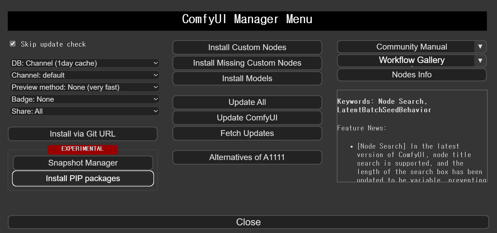

# 커스텀 노드

<https://github.com/ltdrdata/ComfyUI-Manager>

> 커스텀 노드 관리

<https://github.com/Kosinkadink/ComfyUI-AnimateDiff-Evolved>

> AnimateDiff

<https://github.com/Kosinkadink/ComfyUI-Advanced-ControlNet>

> AnimateDiff + ControlNet

https://github.com/Fannovel16/comfyui_controlnet_aux

> ControlNet Preprocessors


* 비디오 저장

https://github.com/Kosinkadink/ComfyUI-VideoHelperSuite


* 프롬프트 스케쥴

https://github.com/FizzleDorf/ComfyUI_FizzNodes


# AnimateDiff 모델

<https://huggingface.co/guoyww/animatediff/resolve/main/mm_sd_v15_v2.ckpt>

<https://huggingface.co/guoyww/animatediff/resolve/main/mm_sd_v15.ckpt>

<https://huggingface.co/guoyww/animatediff/resolve/main/mm_sd_v14.ckpt>

<https://huggingface.co/CiaraRowles/TemporalDiff/resolve/main/temporaldiff-v1-animatediff.ckpt>

> custom_nodes/ComfyUI-AnimateDiff-Evolved/models 이곳에 저장  

<https://huggingface.co/guoyww/animatediff/resolve/main/v2_lora_PanLeft.ckpt>

<https://huggingface.co/guoyww/animatediff/resolve/main/v2_lora_PanRight.ckpt>

<https://huggingface.co/guoyww/animatediff/resolve/main/v2_lora_ZoomOut.ckpt>

<https://huggingface.co/guoyww/animatediff/resolve/main/v2_lora_ZoomIn.ckpt>

<https://huggingface.co/guoyww/animatediff/resolve/main/v2_lora_TiltUp.ckpt>

<https://huggingface.co/guoyww/animatediff/resolve/main/v2_lora_TiltDown.ckpt>

> custom_nodes/ComfyUI-AnimateDiff-Evolved/motion_lora 이곳에 저장  

# Workflow

(마우스 오른쪽버튼을 누르고 링크 저장을 눌러주세요)

<a href="./comfyui_animatediff/workflow.zip">workflow.zip</a> (전체 압축파일)

* 타일 2이미지 전환

<a href="./comfyui_animatediff/cn_2image.json">cn_2image_upscale.json</a>

<a href="./comfyui_animatediff/cn_2image_upscale.json">cn_2image_upscale.json</a>

* 32프레임 이상 타일 2이미지 전환

<a href="./comfyui_animatediff/cn_adv_2image.json">cn_adv_2image.json</a>

(생성한 이미지로 설정하고 프롬프트도 맟추면 초기 이미지 애니메이션)

* 모션로라

<a href="./comfyui_animatediff/motion_lora.json">motion_lora.json</a>

<a href="./comfyui_animatediff/motion_lora2.json">motion_lora2.json</a>

* 오픈포즈 애니메이션

<a href="./comfyui_animatediff/openpose_animation.json">openpose_animation.json</a>

* 애니메이션 vid2vid

<a href="./comfyui_animatediff/1%20%2D%20Basic%20Vid2Vid%201%20ControlNet%2Ejson">1 - Basic Vid2Vid 1 ControlNet.json</a>

<a href="./comfyui_animatediff/2%20%2D%20Vid2Vid%20Multi%2DControlNet%2Ejson">2 - Vid2Vid Multi-ControlNet.json</a>


# Workflow vid2vid 가이드

https://civitai.com/articles/2379/guide-comfyui-animatediff-guideworkflows-including-prompt-scheduling-an-inner-reflections-guide

# Lora

[harley-quinn](https://civitai.com/models/55639/harley-quinn-or-suicide-squad)


# 프롬프트 정보

긍정 프롬프트

```
(best quality, masterpiece:1.2), ultra high res, complex detail, 1girl, black_eyes, black_hair, solo, dancing wearing floral dress in the cathedral
```

```
(masterpiece, best quality, high quality:1.2), ultra high res, 8k, (beautiful detailed face, beautiful detailed eyes), extremely detailed CG unity 8k wallpaper, 1girl, beautiful girl, cute, in the beach, (smile:0.6), 
```

```
(Masterpiece, best quality:1.2), a girl with blue hair, jean, white t-shirt, sunshine and beach
```

```
(best quality, masterpiece:1.2), ultra high res, complex detail, 1girl, dancing wearing floral dress in the cathedral,
pikkyharleyquinn, blonde hair, multicolored hair, blue hair, pink hair, twintails, long hair, bangs, blue eyes, green eyes, red lips,
```

부정 프롬프트

```
ng_deepnegative_v1_75t, (worst quality, low quality:1.3), nsfw, nude
```


# ComfyUI-VideoHelperSuite 노드가 나타나지 않는경우 

* 실행할때 아래 메세지가 나오는지 확인해보세요~

```
no module named 'cv2'
```

1. Manger 이용 방법

> Manager 메뉴에서 Install PIP Packages 를 누르고 opencv-python 를 입력해서 설치해보세요 (설치 완료까지 대기후 재시작)



2. 직접설치 방법

> 윈도우의 경우 아래처럼 "명령 프롬프트"에서 comfyui 설치폴더로 이동후 opencv-python을 직접 설치해주세요

```
python_embeded\python -m pip install opencv-python
```


