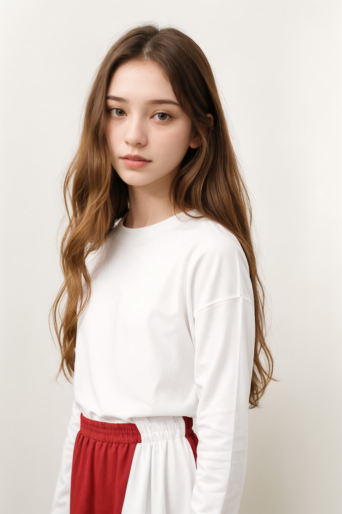

3

# 샘플이미지




# 워크플로우

<https://raw.githubusercontent.com/ninjaneural/webui/master/memo/comfyui_custompose/workflow1.json>

<https://raw.githubusercontent.com/ninjaneural/webui/master/memo/comfyui_custompose/workflow2.json>


(마우스 오른쪽버튼을 누르고 링크 저장을 눌러주세요)


# 페이스ID, 페이스스왑 

<https://youtu.be/iCtyKP6sYNU>

<https://github.com/ninjaneural/webui/blob/master/memo/comfyui_faceswap.md>


# 커스텀노드

<https://github.com/Suzie1/ComfyUI_Comfyroll_CustomNodes>

<https://github.com/pythongosssss/ComfyUI-WD14-Tagger>

<https://github.com/Fannovel16/comfyui_controlnet_aux>


# 프롬프트


긍정 프롬프트들
```
masterpiece, best quality,8k uhd, ultra realistic,realistic, photorealistic, RAW,
```

부정 프롬프트
```
(worst quality,low quality,normal quality:1.2),nsfw, nude
```
