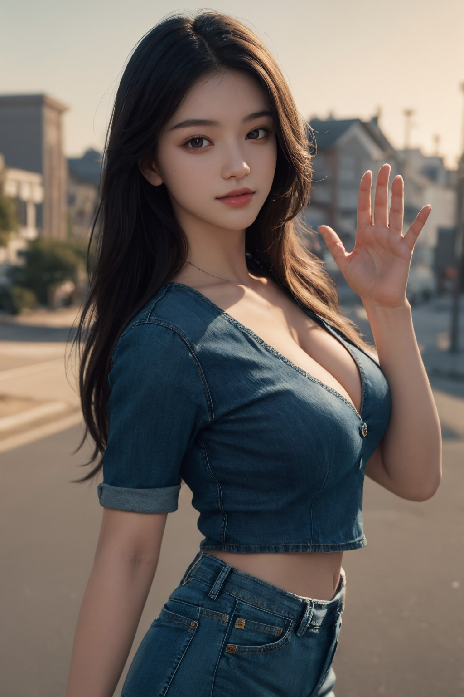
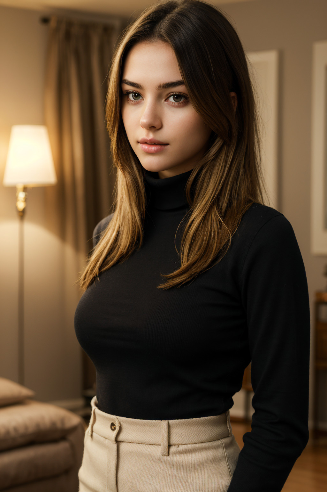
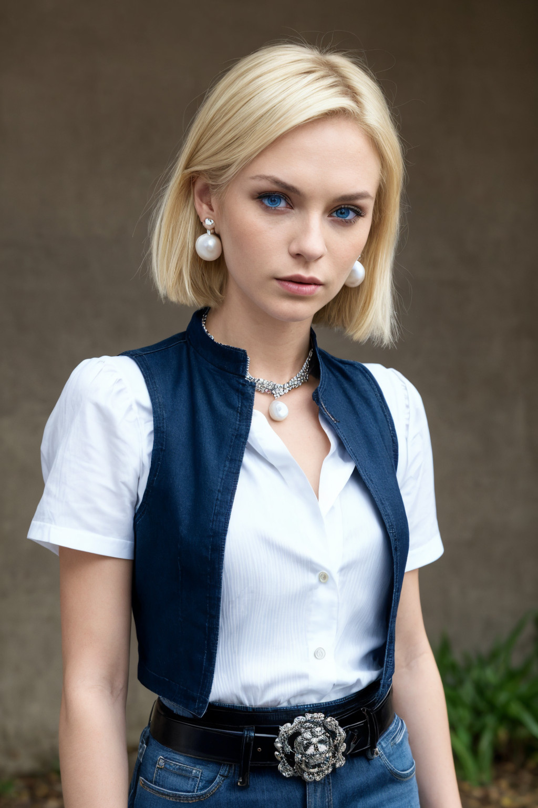
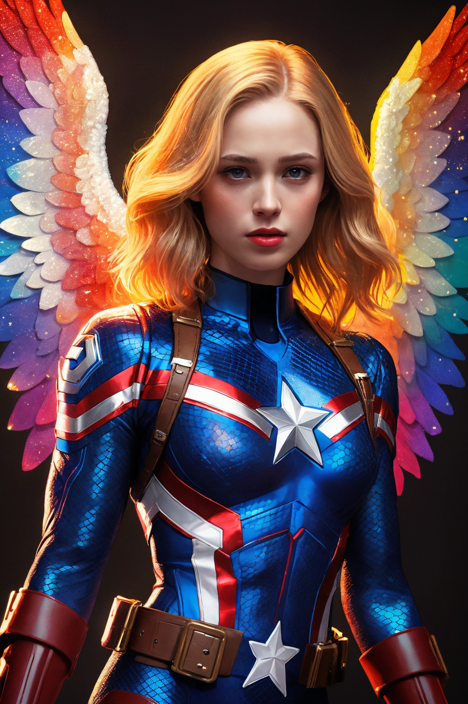
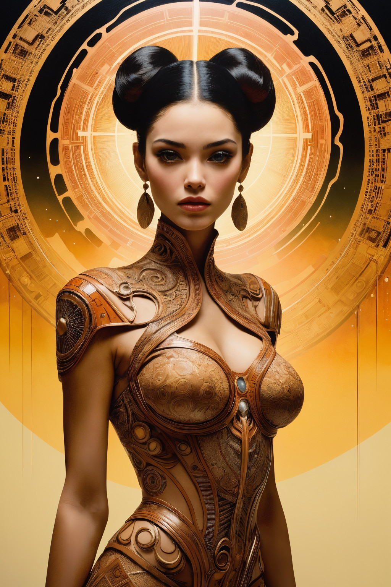
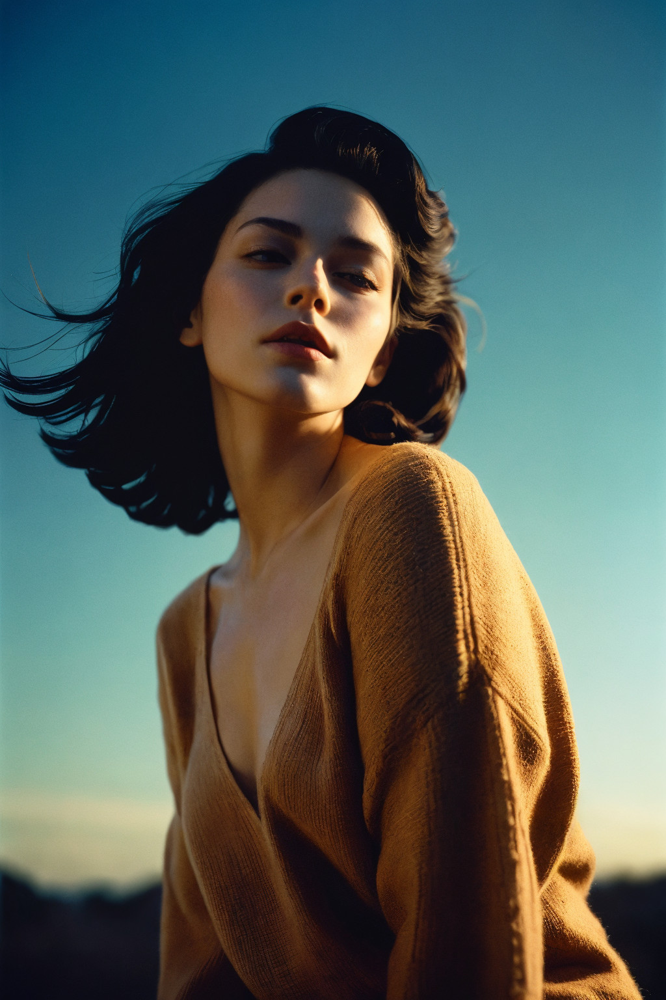

# 샘플이미지









# 워크플로우

(마우스 오른쪽버튼을 누르고 링크 저장을 눌러주세요)

기본 워크플로우

<https://raw.githubusercontent.com/ninjaneural/webui/master/memo/comfyui_faceswap/workflow1.json>

이미지 생성없이 기존 이미지 수정

<https://raw.githubusercontent.com/ninjaneural/webui/master/memo/comfyui_faceswap/workflow3.json>

SDXL버전

<https://raw.githubusercontent.com/ninjaneural/webui/master/memo/comfyui_faceswap/workflow4.json>

---

**IPAdapter Plus 2024-03-26 이후 버전 워크플로우**

<https://raw.githubusercontent.com/ninjaneural/webui/master/memo/comfyui_faceswap/20240326/workflow1.json>

이미지 생성없이 기존 이미지 수정

<https://raw.githubusercontent.com/ninjaneural/webui/master/memo/comfyui_faceswap/20240326/workflow3.json>

SDXL버전

<https://raw.githubusercontent.com/ninjaneural/webui/master/memo/comfyui_faceswap/20240326/workflow4.json>

*통합버전 (새로워진 IPAdapter Plus 방식)*

> 모든 파일명을 맞췄을경우 하나의 노드로 통합가능해요    

<https://raw.githubusercontent.com/ninjaneural/webui/master/memo/comfyui_faceswap/20240326/workflow.json>

(마우스 오른쪽버튼을 누르고 링크 저장을 눌러주세요)


# IPAdapter_plus

* 커스텀노드 ComfyUI_IPAdapter_plus

<https://github.com/cubiq/ComfyUI_IPAdapter_plus>

* faceid-plus-v2 모델 다운로드

<https://huggingface.co/h94/IP-Adapter-FaceID/resolve/main/ip-adapter-faceid-plusv2_sd15.bin>

> [v1 legecy] <strike>ComfyUI 설치폴더/custom_nodes/ComfyUI_IPAdapter_plus/models 이곳에 복사</strike>  
> [2024-03-26 v2 적용] ComfyUI 설치폴더/models/ipadapter 이곳에 복사 (폴더 없으면 생성)

* faceid-plus-v2 로라 다운로드

<https://huggingface.co/h94/IP-Adapter-FaceID/resolve/main/ip-adapter-faceid-plusv2_sd15_lora.safetensors>

> [v1 legecy] <strike>ComfyUI 설치폴더/models/loras 이곳에 복사</strike>  
> [2024-03-26 v2 적용] ComfyUI 설치폴더/models/ipadapter 이곳에 복사 (폴더 없으면 생성)

* clip vision 모델 (CLIP-ViT-H-14-laion2B-s32B-b79K) 다운로드

<https://huggingface.co/h94/IP-Adapter/resolve/main/models/image_encoder/model.safetensors>

> 설치폴더/models/clip_vision 이곳에 복사  
> 파일명을 CLIP-ViT-H-14-laion2B-s32B-b79K.safetensors 으로 변경해주세요


# IPAdapter_plus (SDXL)

* faceid-plusv2_sdxl 모델 다운로드

<https://huggingface.co/h94/IP-Adapter-FaceID/resolve/main/ip-adapter-faceid-plusv2_sdxl.bin>

> [v1 legecy] <strike>ComfyUI 설치폴더/custom_nodes/ComfyUI_IPAdapter_plus/models 이곳에 복사</strike>  
> [2024-03-26 v2 적용] ComfyUI 설치폴더/models/ipadapter 이곳에 복사 (폴더 없으면 생성)

* faceid-plusv2_sdxl 로라 다운로드

<https://huggingface.co/h94/IP-Adapter-FaceID/resolve/main/ip-adapter-faceid-plusv2_sdxl_lora.safetensors>

> [v1 legecy] <strike>ComfyUI 설치폴더/models/loras 이곳에 복사</strike>  
> [2024-03-26 v2 적용] ComfyUI 설치폴더/models/ipadapter 이곳에 복사 (폴더 없으면 생성)

* clip vision 모델 (CLIP-ViT-bigG-14-laion2B-39B-b160k) 다운로드 (Optional)

<https://huggingface.co/h94/IP-Adapter/resolve/main/sdxl_models/image_encoder/model.safetensors>

> 설치폴더/models/clip_vision 이곳에 복사  
> 파일명을 CLIP-ViT-bigG-14-laion2B-39B-b160k.safetensors 으로 변경해주세요


# ReActor

* 커스텀노드 comfyui-reactor-node

<https://github.com/Gourieff/comfyui-reactor-node>

* inswapper_128 모델 다운로드 (Optional)

<https://huggingface.co/ninjaneural/webui/resolve/main/inswapper_128.onnx>

> 자동으로 다운로드 안되었을때만 설치하시면되요  
> ComfyUI 설치폴더/models/insightface 이곳에 복사

* restore 모델 다운로드 (Optional)

<https://github.com/TencentARC/GFPGAN/releases/download/v1.3.4/GFPGANv1.4.pth>

* insightface 모듈이 없다고 뜰때

Manager > Install PIP packages 에서 insightface 입력후 재시작


# insightface 에러관련

Install PIP packages으로 설치하고 재시작해도 안될때 참고해보세요~

https://github.com/Gourieff/comfyui-reactor-node#i-for-windows-users-if-you-still-cannot-build-insightface-for-some-reasons-or-just-dont-want-to-install-visual-studio-or-vs-c-build-tools---do-the-following


# 공통 프롬프트

부정 프롬프트
```
(worst quality,low quality,normal quality:1.2),nsfw, nude
```

샘플러, 모델, 시드
```
Steps: 25, Sampler: dpmpp_2m, CFG scale: 6.5, Seed: 2222, Size: 1024x1536, Model: majicMIX_realistic_v6
```

# 사용한 긍정 프롬프트들

```
masterpiece, best quality,8k uhd, ultra realistic,realistic, photorealistic, RAW,
spring day, soft lighting, high quality, 1girl, cute,
long hair, brown hair,lustrous skin,medium breast, jean, hoodie

lucy \(cyberpunk\), 1girl,  hair scrunchie, hime cut, silver hair, colored tips, full moon, grey eyes, jacket, long sleeves, looking at viewer, medium hair, multicolored hair, parted bangs, parted lips, pink hair, portrait, red eyeliner, red lips, solo, white jacket, cyberpunk \(series\), rainy night in a cyberpunk city with glowing neon lights

(ultra realistic details), octane render, 8k, masterpiece, rtx, reflections, high quality, best quality, high resolution, 4k, high definition, beautiful lighting,highly detailed face, makima \(chainsaw man\), (red hair)+(long braided hair)+(bangs), yellow eyes, golden eyes, (ringed eyes), (white shirt), (necktie) ,

(masterpiece, best quality, ultra-detailed, best shadow), ultra realistic 8k, picture-perfect face, space scene, 1girl, photo of a beautiful blonde woman wearing a red spandex space suit, flawless, clean, cinematic lighting, cinematic bloom, perfect face, beautiful blue eyes, (perfect female body, narrow waist), sci-fi scene, science fiction, intricate detail, charming, 

(masterpiece, best quality, ultra-detailed, best shadow),1girl, android 18, blonde hair, blue eyes, belt, jeans, pearl_necklace, bracelet, black gloves, white shirt, short hair, short sleeves, earrings, blue pants, open vest, black vest, ,necromancer, skeleton, skull, bone, ribs, flower, from side, (1other), 

masterpiece, best quality, illustration, (realistic, photo-realistic), amazing, finely detail, incredibly absurdres, huge filesize, ultra-detailed, highres, extremely detailed CG unity 8k wallpaper, ray tracing, 1girl, 20y.o. young girl, (flawless beauty face, beautiful, aesthetic:1.2), big eyes, tall, perfect female body proportions, slender and narrow waist, a flawless girl with angelic wings reclining on a golden throne, dressed in an intricate white robe embellished with gold accents and holding a jeweled scepter. She has an ethereal beauty, with flowing blonde hair and a serene expression. The throne is ornately carved and encrusted with precious gems and pearls. Behind her, a set of large feathered wings in whites and golds arc gracefully. The scene is bathed in golden celestial light with solarpunk elements. The style combines futuristic, celestialpunk and solarpunk with exquisite attention to detail in the clothing, wings and throne. The composition is symmetrical and aesthetically balanced.

masterpiece, best quality, official art, unity 8k wallpaper, ultra detailed, beautiful and aesthetic, beautiful, channeling arcane energies that ripple and distort the very air, abstract perspective, covered with small bones, gooey liquid neon color hair and lips, highly refractive skin with small rainbow sparkles, glowing color exploding cell shading, Voronoi diagrams sparkling lighting, Dappled Light, ((A canvas of code and creativity, bits and brushes unite, unveiling the portrait beyond pixels)), dreamy magical atmosphere, (skin texture), (film grain), (warm hue, warm tone), cinematic light, side lighting, Captain America (Marvel Comics): Captain America's suit features a blue, scale-patterned jumpsuit with a white star emblem on the chest, along with red and white stripes on the abdomen. He wears red boots, gloves, and a utility belt, as well as a blue helmet with wings on the sides

1girl, official art, (beautiful and aesthetic), ,extreme detailed, (fractal art), colorful, highest detailed,pale skin ,the creamy smooth skin, alien ruins,optical camouflage,silver, ,sapphire,blue water,(wind:1.2),blue glass ,huge blue stone,cosmic,glass body,

masterpiece, best quality, absurdres, illustration, watercolor,1girl,young girl, in water, solo, long hair, dress, bare shoulders, standing, abstract dark fluid art, (gold and marble:0.6), (splash:1.2), swirls, flow, dynamic, expressive, intricate, muted colors, (contrast) , outdoors, cloud, sky, water, water splashes, rainbow,(blue, red, pink, flower clusters), (iridescence holographic Clothing),

(best quality, masterpiece, colorful, dynamic angle, highest detailed), upper body photo, fashion photography of cute european girl with iridiscent pink hair, flirting with POV, in traditional japanese gold+black kimono, ultra detailed kimono textures, high contrast, night, kyoto, fireworks, (intricate details, hyperdetailed), detailed, moonlight passing through hair, (official art, extreme detailed, highest detailed),
```