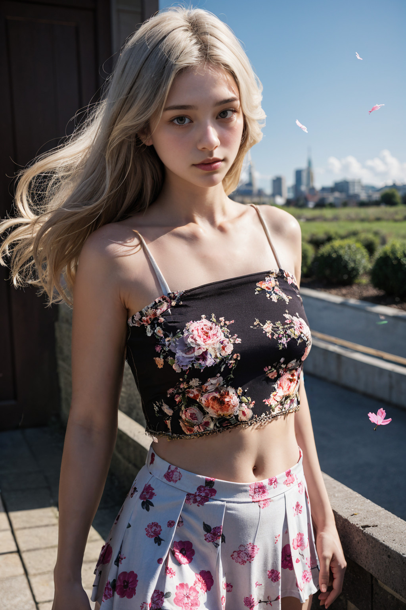
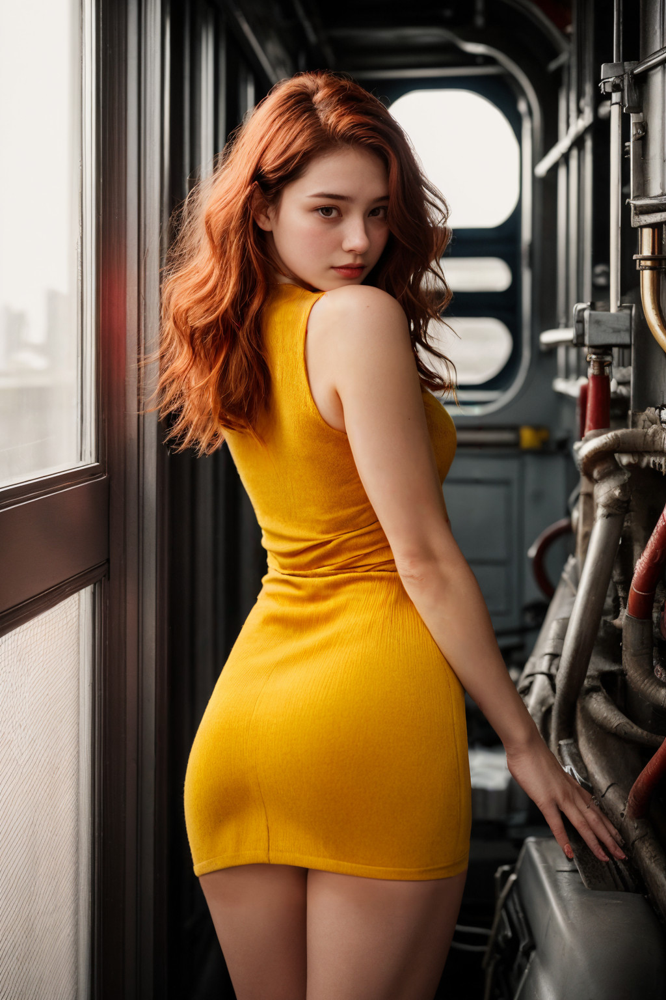

# 샘플이미지

# 워크플로우

기본 배경생성+조명 워크플로우 (fc모델)

<https://raw.githubusercontent.com/ninjaneural/webui/master/memo/comfyui_iclight/workflow1.json>

기본 배경을 이용한 조명 워크플로우 (fbc모델)

<https://raw.githubusercontent.com/ninjaneural/webui/master/memo/comfyui_iclight/workflow2.json>

기본 배경생성+조명+페이스디테일 워크플로우 (fc모델)

<https://raw.githubusercontent.com/ninjaneural/webui/master/memo/comfyui_iclight/workflow3.json>

기본 배경합성을 이용한 조명 워크플로우 (fc모델)

<https://raw.githubusercontent.com/ninjaneural/webui/master/memo/comfyui_iclight/workflow4.json>

(마우스 오른쪽버튼을 누르고 링크 저장을 눌러주세요)

# 그외 커스텀노드

<https://github.com/kijai/ComfyUI-IC-Light>

> IC-Light 커스텀 노드

<https://github.com/Fannovel16/ComfyUI-Video-Matting>

> Video Matting 배경 삭제 커스텀 노드

<https://github.com/cubiq/ComfyUI_essentials>

> 이미지 관련 커스텀노드 (뼈다귀모양)

<https://github.com/kijai/ComfyUI-KJNodes>

> 마스크 관련노드, 원형 마스크 생성

<https://github.com/WASasquatch/was-node-suite-comfyui> 

> 이미지,마스크등 관련 커스텀노드 

<https://github.com/ltdrdata/ComfyUI-Impact-Pack>

> 각종 디텍터, 페이스 디테일러 

# IC-Light 모델

<https://huggingface.co/lllyasviel/ic-light/resolve/main/iclight_sd15_fc.safetensors>
<https://huggingface.co/lllyasviel/ic-light/resolve/main/iclight_sd15_fbc.safetensors>

> ComfyUI설치폴더/models/unet 에 저장해주세요  

