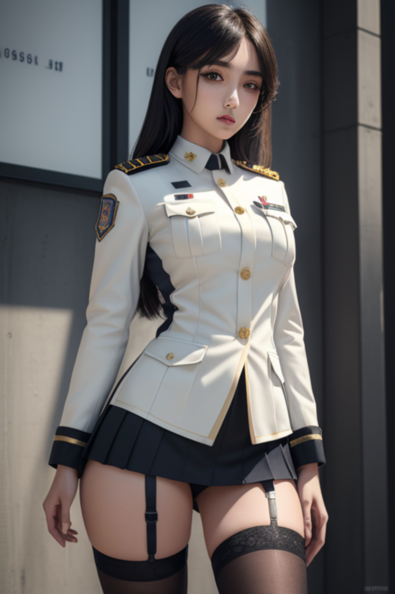
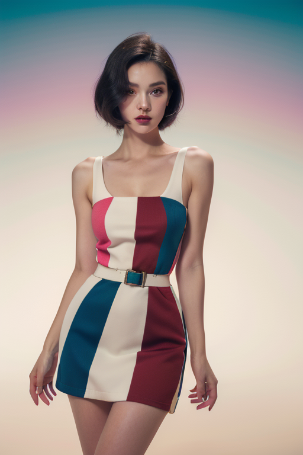

# 샘플이미지

  

  

  

  

# 워크플로우

기본 생성 워크플로우 txt2img

<https://raw.githubusercontent.com/ninjaneural/webui/master/memo/comfyui_img2img/workflow1.json>

기본 워크플로우 img2img

<https://raw.githubusercontent.com/ninjaneural/webui/master/memo/comfyui_img2img/workflow2.json>

KSAMPLER 두개로 나눈 워크플로우 img2img

<https://raw.githubusercontent.com/ninjaneural/webui/master/memo/comfyui_img2img/workflow3.json>

txt2img와 img2img 합친 워크플로우 (hires fix)

<https://raw.githubusercontent.com/ninjaneural/webui/master/memo/comfyui_img2img/workflow4.json>

txt2img와 img2img 합친 워크플로우 (hires fix) + 프롬프트 같이 정리

<https://raw.githubusercontent.com/ninjaneural/webui/master/memo/comfyui_img2img/workflow5.json>

(마우스 오른쪽버튼을 누르고 링크 저장을 눌러주세요)
