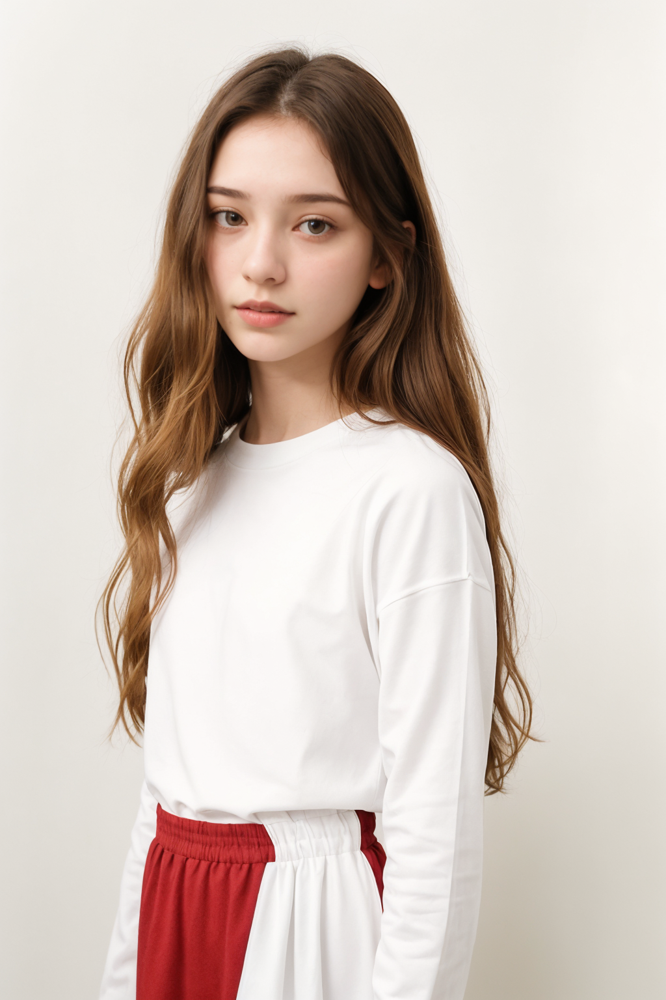

# 샘플이미지

# 워크플로우

<https://raw.githubusercontent.com/ninjaneural/webui/master/memo/comfyui_posechange/workflow1.json>

(마우스 오른쪽버튼을 누르고 링크 저장을 눌러주세요)

# IPAdapter_plus

* 커스텀노드 ComfyUI_IPAdapter_plus

<https://github.com/cubiq/ComfyUI_IPAdapter_plus>

* plus_sd15 모델 다운로드

<https://huggingface.co/h94/IP-Adapter/resolve/main/models/ip-adapter-plus_sd15.bin>

> ComfyUI 설치폴더/custom_nodes/ComfyUI_IPAdapter_plus/models 이곳에 복사

<https://huggingface.co/h94/IP-Adapter/tree/main/models>

> 그외에 기본, light, face, full 모델들

* clip vision 모델 다운로드 (Optional)

<https://huggingface.co/h94/IP-Adapter/resolve/main/models/image_encoder/model.safetensors>

> 없다면 다운받아주세요

# 그외 커스텀노드

<https://github.com/Suzie1/ComfyUI_Comfyroll_CustomNodes> 

> CR_ 시리즈 노드

<https://github.com/Fannovel16/comfyui_controlnet_aux>

> ControlNet 프리프로세서 노드

<https://github.com/pythongosssss/ComfyUI-WD14-Tagger>

> Tagger 이미지에서 프롬프트 추출

<https://github.com/pythongosssss/ComfyUI-Custom-Scripts>

> pysssss 시리즈 노드 / 하단 이미지 피드
