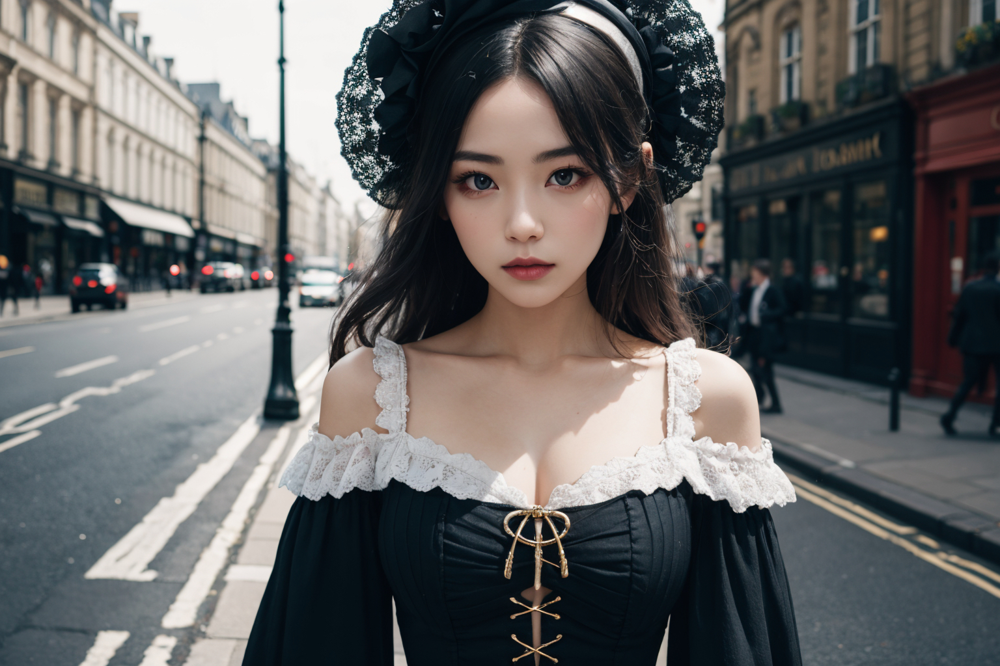
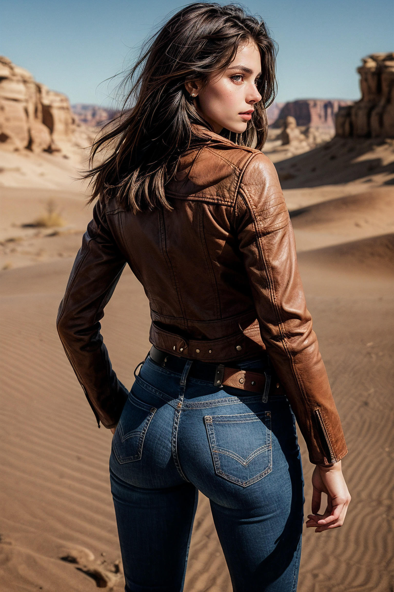

# 샘플이미지

# 워크플로우

워크플로우

<https://raw.githubusercontent.com/ninjaneural/webui/master/memo/comfyui_removechar/workflow1.json>

2024-03-26 이후 

<https://raw.githubusercontent.com/ninjaneural/webui/master/memo/comfyui_removechar/20240326/workflow1.json>

(마우스 오른쪽버튼을 누르고 링크 저장을 눌러주세요)

# 그외 커스텀노드

<https://github.com/Fannovel16/comfyui_controlnet_aux>

> ControlNet 프리프로세서 노드

<https://github.com/pythongosssss/ComfyUI-Custom-Scripts>

> pysssss 커스텀 스크립트, 이미지 최대값 리사이즈

<https://github.com/pythongosssss/ComfyUI-WD14-Tagger>

> Tagger 이미지 -> 프롬프트

<https://github.com/cubiq/ComfyUI_IPAdapter_plus>

> IPAdapter 사용

<https://github.com/cubiq/ComfyUI_essentials>

> 마스크 처리

<https://github.com/Layer-norm/comfyui-lama-remover>

> 라마(LaMA)

<https://github.com/melMass/comfy_mtb>

> rembg (배경 이미지 지우기)

# 모델

* clip vision 모델 (CLIP-ViT-H-14-laion2B-s32B-b79K) 다운로드 (Optional)

<https://huggingface.co/h94/IP-Adapter/resolve/main/models/image_encoder/model.safetensors>

> 설치폴더/models/clip_vision 이곳에 복사  
> 파일명을 CLIP-ViT-H-14-laion2B-s32B-b79K.safetensors 으로 변경해주세요

* ip-adapter_sd15 모델 다운로드

<https://huggingface.co/h94/IP-Adapter/resolve/main/models/ip-adapter_sd15.safetensors>

> [v1 legecy] <strike>ComfyUI 설치폴더/custom_nodes/ComfyUI_IPAdapter_plus/models 이곳에 복사</strike>  
> [2024-03-26 v2 적용] ComfyUI 설치폴더/models/ipadapter 이곳에 복사 (폴더 없으면 생성)

* 컨트롤넷 inpaint 모델

<https://huggingface.co/comfyanonymous/ControlNet-v1-1_fp16_safetensors/resolve/main/control_v11p_sd15_inpaint_fp16.safetensors>
<https://huggingface.co/comfyanonymous/ControlNet-v1-1_fp16_safetensors>

> ComfyUI 설치폴더/models/controlnet 이곳에 복사

# 사용한 체크포인트

realisticVision V51
