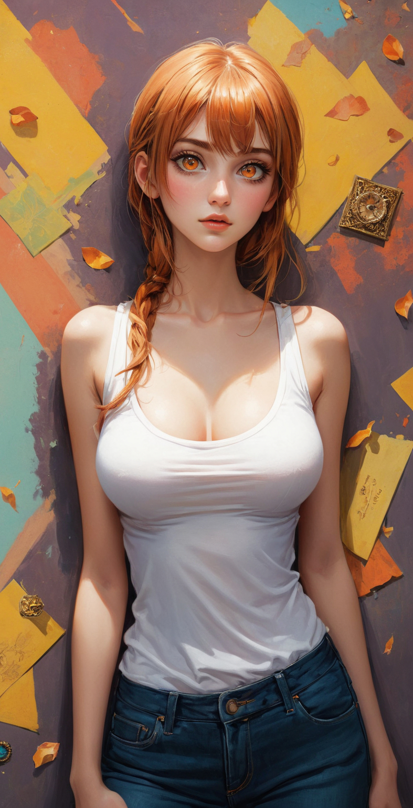
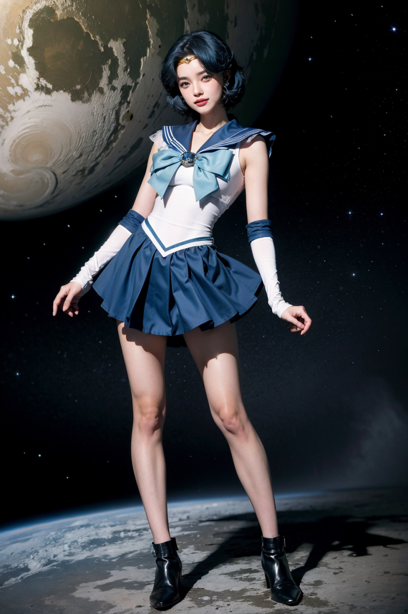
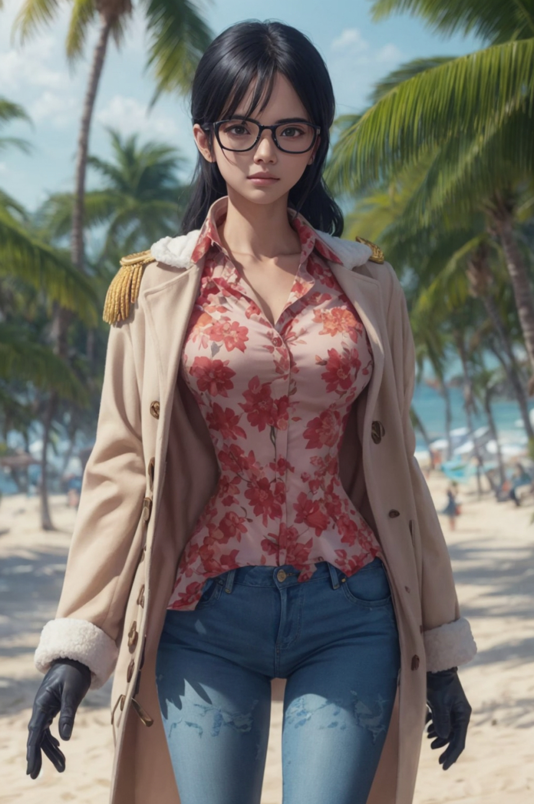
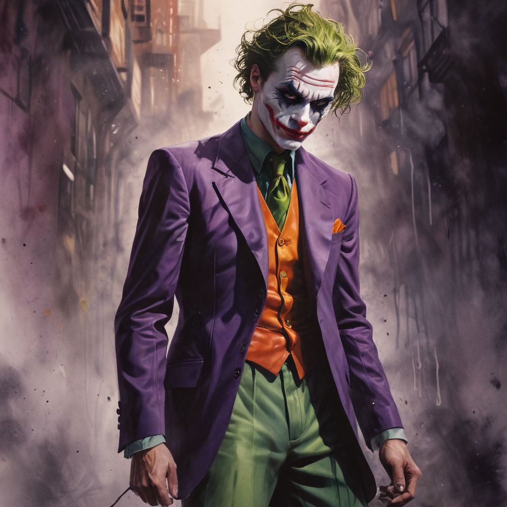

# 샘플이미지

# 워크플로우

워크플로우

<https://raw.githubusercontent.com/ninjaneural/webui/master/memo/comfyui_viggle/workflow1.json> (LAMA를 이용한 캐릭터 삭제 배경)

<https://raw.githubusercontent.com/ninjaneural/webui/master/memo/comfyui_viggle/workflow2.json> (AnimateDiff 예시)

<https://raw.githubusercontent.com/ninjaneural/webui/master/memo/comfyui_viggle/workflow3.json> (AnimateDiff 예시, SDXL)

<https://raw.githubusercontent.com/ninjaneural/webui/master/memo/comfyui_viggle/workflow2_2.json> (AnimateDiff 예시2)

(마우스 오른쪽버튼을 누르고 링크 저장을 눌러주세요)

