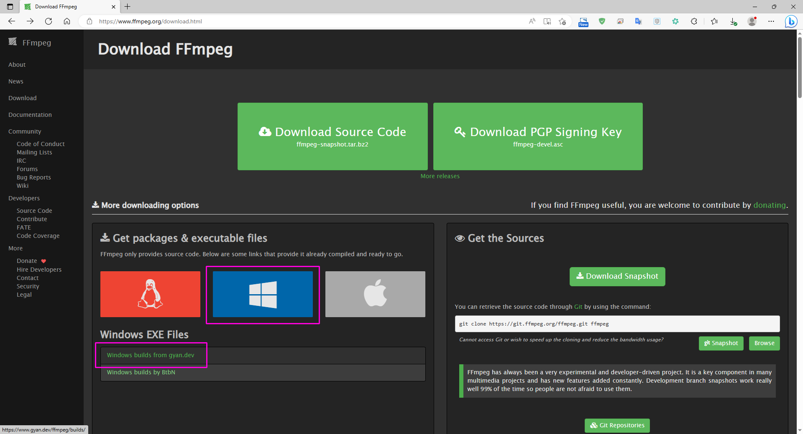
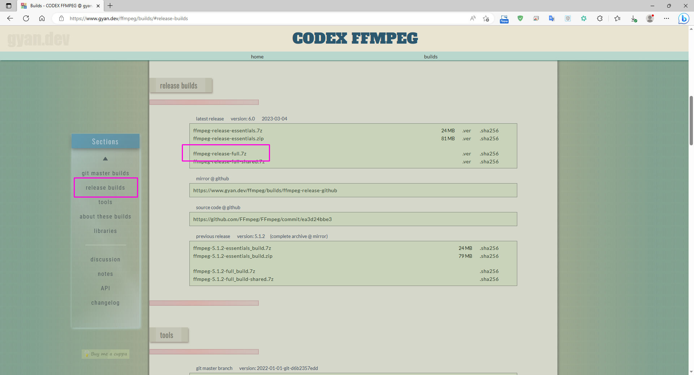
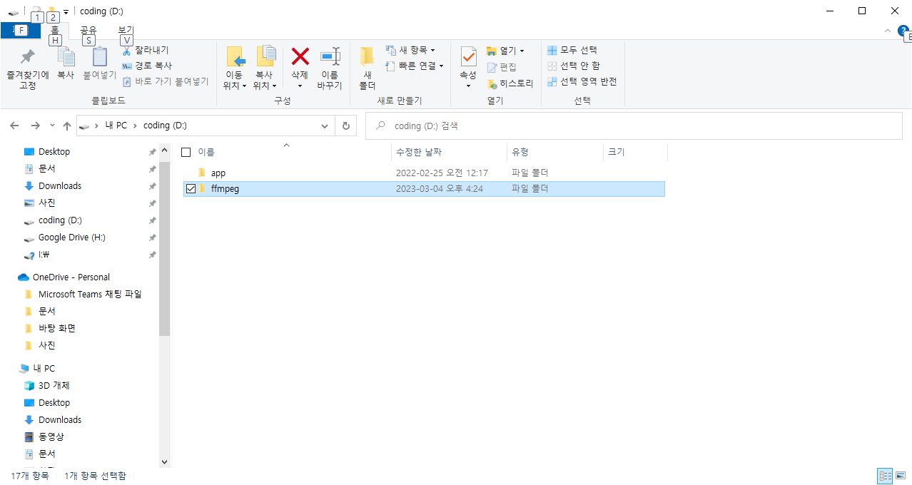
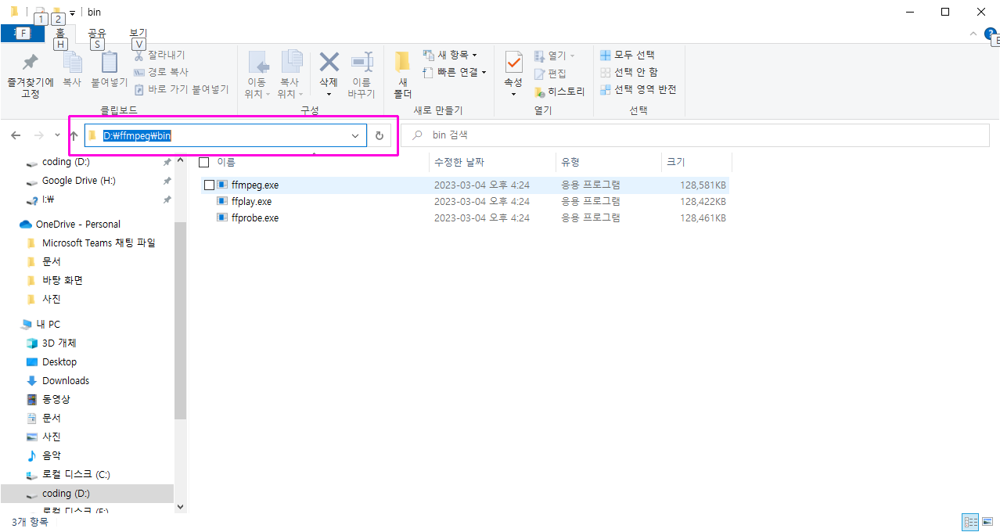
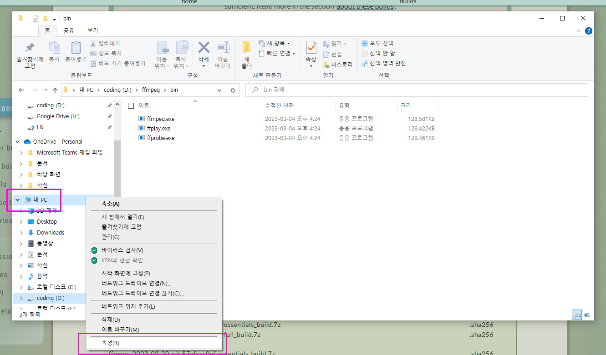
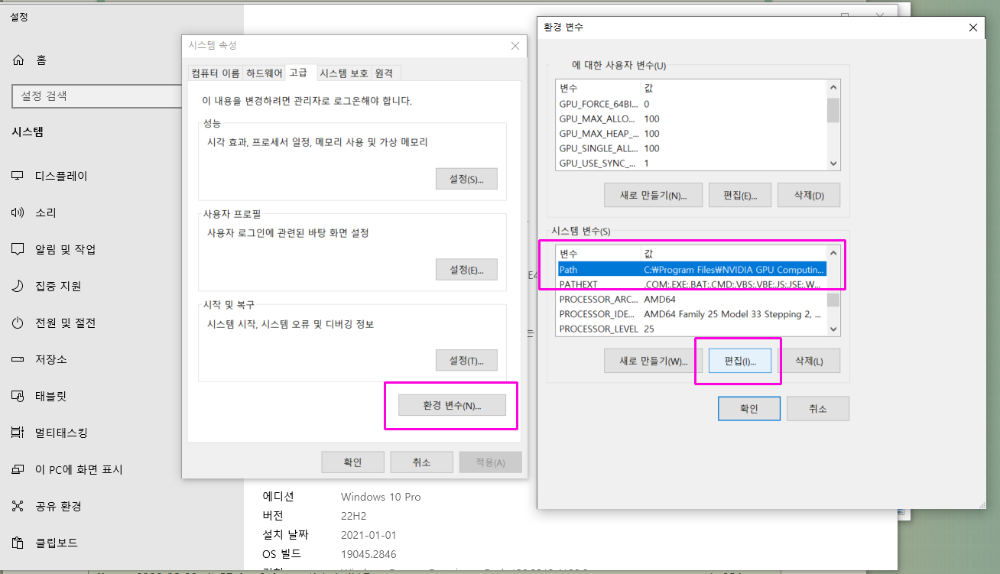
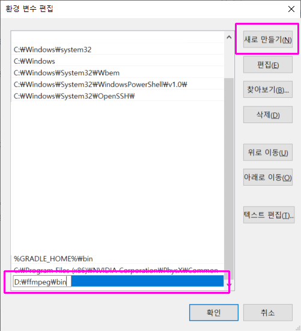

1. https://www.ffmpeg.org/download.html 접속

  

- 윈도우 아이콘 클릭
- Windows builds from gyan.dev 클릭

---

2. 프로그램 다운로드

  

- release builds 클릭
- ffmpeg-release-full.7z 클릭(다운로드)

---

3. 다운받은 ffmpeg release 파일을 적당한곳에 압축품

  

- 폴더명 변경 (안해도됨)

---

4. bin폴더 경로 복사

  

- 압축푼 폴더 바로밑에 bin폴더가 있고 ffmpeg.exe가 있음
- 탐색기에서 위치클릭하면 바로 복사가능

---

5. 설정 정보

  

- 탐색기 내PC 마우스 오른쪽클릭
- 속성 클릭

---

6. 시스템 속성

  

- 환경변수 클릭
- 시스템 변수에서 Path 찾아서 클릭
- 편집 클릭

---

7. 환경 변수 편집

  

- 새로 만들기 클릭
- 아까 복사한 bin경로 붙여넣기
- 확인 클릭

---
