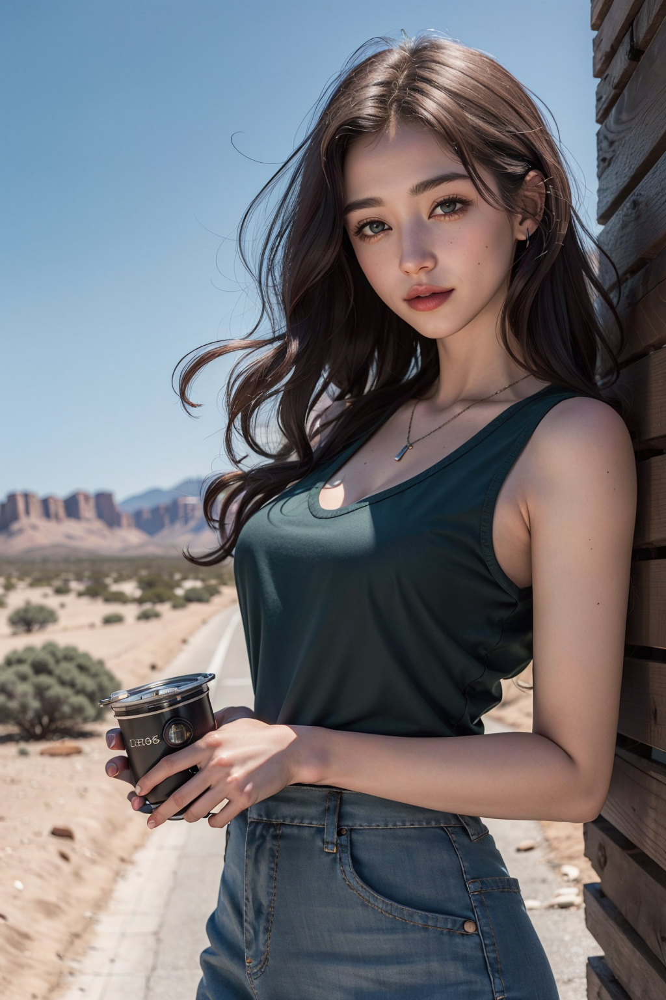

# 프롬프트 정보1

긍정 프롬프트

```
(masterpiece,best quality:1.2), highres, 8k, UHD, complex detail, photorealistic
```

부정 프롬프트

```
(worst quality, low quality:1.4),
```

# 샘플 이미지

- 샘플 이미지1

  

- 샘플 이미지2

  
