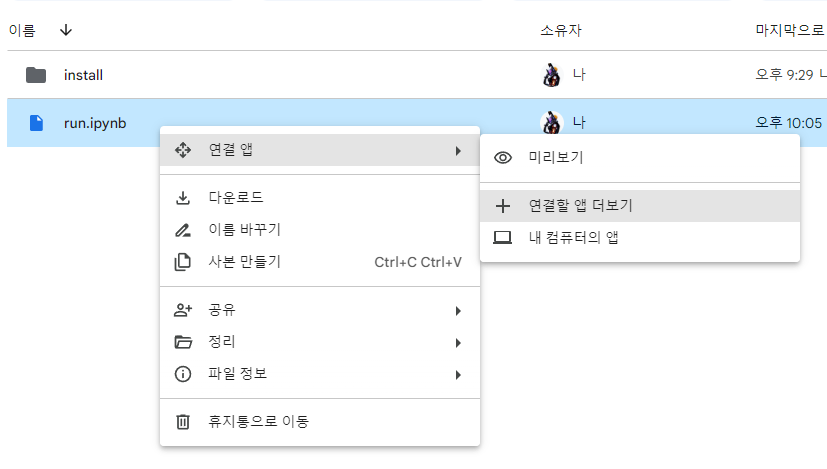
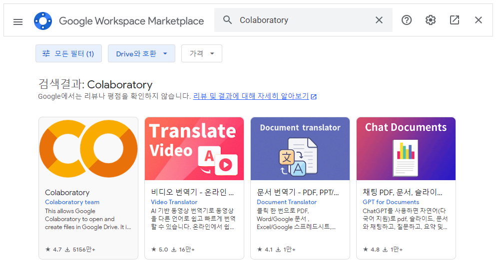
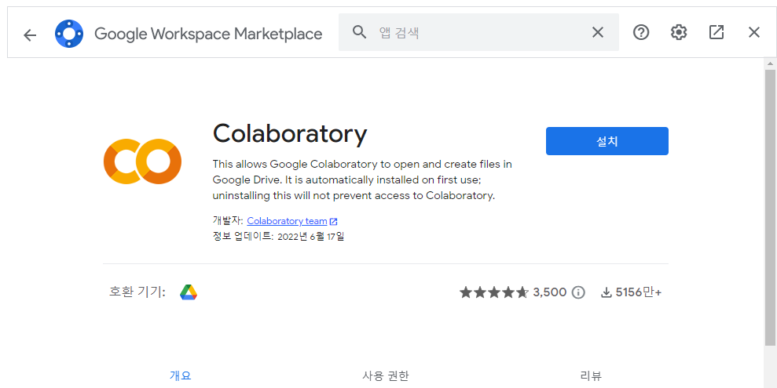

# 실행용 노트북 설명서

install버전으로 최초 한번 설치한후에 이후에 **run.ipynb** 으로 설치없이 실행

## 실행방법

### 1. 구글드라이브에서 실행 (수정가능)

> [run.ipynb 다운로드](https://github.com/ninjaneural/webui/blob/master/install_comfyui/run_direct.ipynb) 프록시없이 실행버전(run_direct.ipynb)  
> [run.ipynb 다운로드](https://github.com/ninjaneural/webui/blob/master/install_comfyui/run.ipynb) 기본버전  

1. run.ipyb 파일 다운로드 (클릭하고 오른쪽위에 다운로드버튼 클릭)

2. 구글드라이브에 업로드

3. 구글드라이브에 Colab앱 설치

    

    

    

3. 구글드라이브에서 실행 (run.ipynb 더블클릭)

### 2. github에서 바로실행 (수정불가)

> [run.ipynb 실행](https://colab.research.google.com/github/ninjaneural/webui/blob/master/install_comfyui/run_direct.ipynb) 프록시없이 실행버전(run_direct.ipynb)  
> [run.ipynb 실행](https://colab.research.google.com/github/ninjaneural/webui/blob/master/install_comfyui/run.ipynb) 기본버전  

