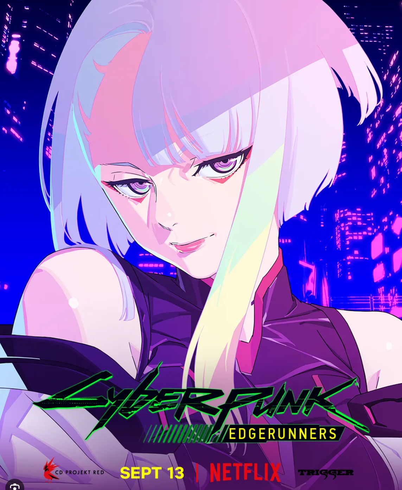
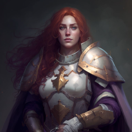
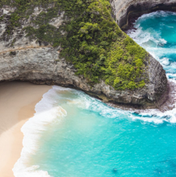
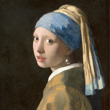
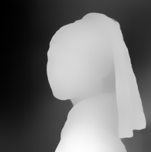
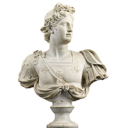
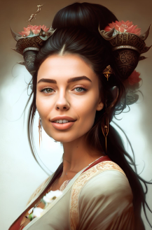

# Embedding

[ng_deepnegative_v1_75t](https://civitai.com/models/4629)

# IP-Adapter 모델 주소

* .pth로 변경해서 컨트롤넷 모델에 저장해주세요

> ip-adapter-plus_sd15.bin -> ip-adapter-plus_sd15.pth  
> extensions/controlnet/models 이곳에 저장  

https://huggingface.co/h94/IP-Adapter/resolve/main/models/ip-adapter_sd15.bin

https://huggingface.co/h94/IP-Adapter/resolve/main/models/ip-adapter-plus_sd15.bin

https://huggingface.co/h94/IP-Adapter/resolve/main/models/ip-adapter-plus-face_sd15.bin


# 프롬프트 정보

긍정 프롬프트

```
masterpiece, (high quality, best quality:1.3), (realistic, photo, uhd, 8k)
```

부정 프롬프트

```
ng_deepnegative_v1_75t, (worst quality, low quality:1.3), nsfw, nude
```

샘플러, 모델, 시드

```
Steps: 20, Sampler: DPM++ 2M Karras, CFG scale: 7, Seed: 3939825425, Size: 512x512, Model hash: e4a30e4607, Model: majicmixRealistic_v6, VAE hash: c6a580b13a, VAE: vae-ft-mse-840000-ema-pruned.vae.pt, Clip skip: 2, ControlNet 0: "Module: ip-adapter_clip_sd15, Model: ip-adapter_sd15 [6a3f6166], Weight: 1, Resize Mode: Crop and Resize, Low Vram: False, Processor Res: 512, Guidance Start: 0, Guidance End: 1, Pixel Perfect: False, Control Mode: Balanced", TI hashes: "ng_deepnegative_v1_75t: 54e7e4826d53", Version: 1.6.0
```

# 기타 추가 프롬프트

긍정 프롬프트

```
(wearing a hat on the beach, beach, sea:1.3), masterpiece, (high quality, best quality:1.3), (realistic, photo, uhd, 8k)
(a beautiful girl wearing casual shirt in a garden), masterpiece, (high quality, best quality:1.3), (realistic, photo, uhd, 8k)
```

















