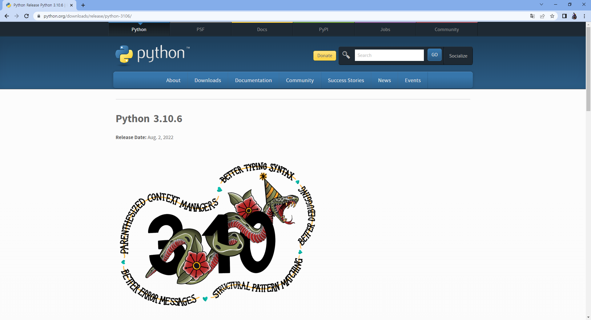
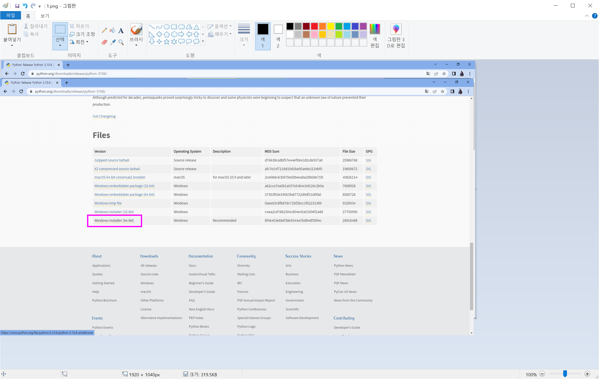
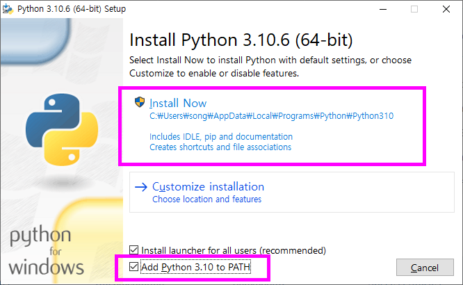

1. https://www.python.org/downloads/release/python-3106/ 접속

  
  

- 하단에 Windows installer (64-bit) 클릭

---

2. 다운받은 python-3.10.6-amd64.exe 실행

  

- Add Python 3.10 to PATH 체크
- Install Now 클릭
