- Image Segmentation

  [https://huggingface.co/spaces/shi-labs/OneFormer](https://huggingface.co/spaces/shi-labs/OneFormer)

- 온라인 포토샵

  [https://www.photopea.com](https://www.photopea.com/)

- Segmentation 색시트 칼라코드

  [https://docs.google.com/spreadsheets/d/1se8YEtb2detS7OuPE86fXGyD269pMycAWe2mtKUj2W8](https://docs.google.com/spreadsheets/d/1se8YEtb2detS7OuPE86fXGyD269pMycAWe2mtKUj2W8)

- 샘플 캐릭터 이미지

  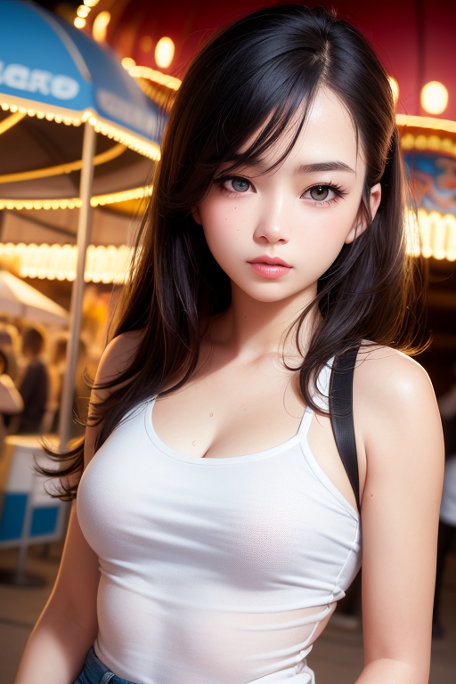

- 배경 이미지

  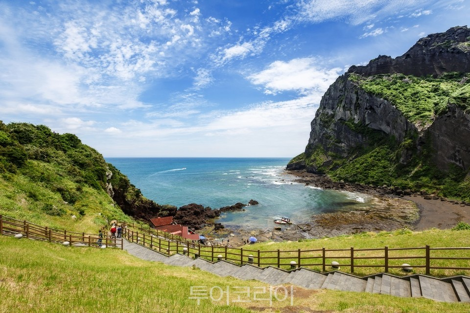

  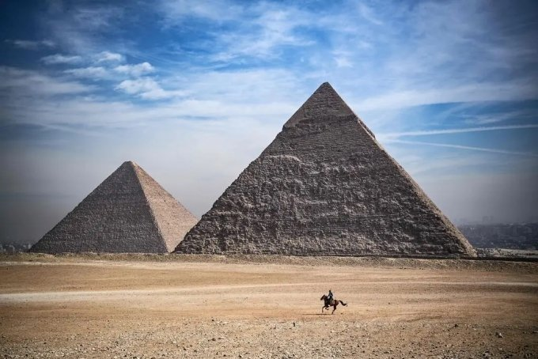

  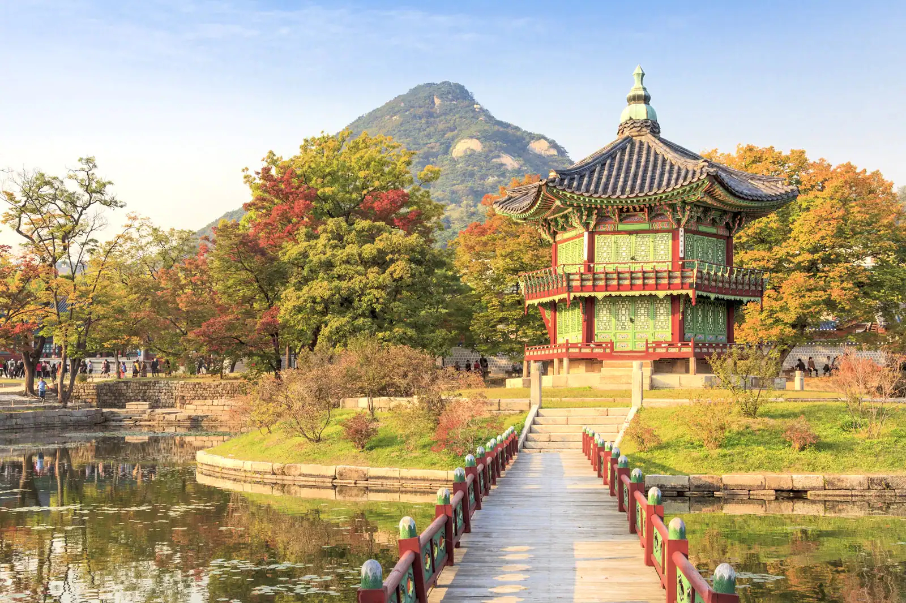

  

- 맵 이미지

  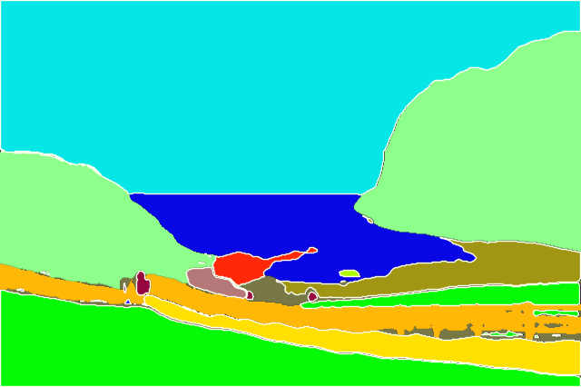

  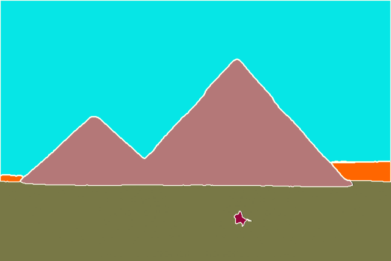

  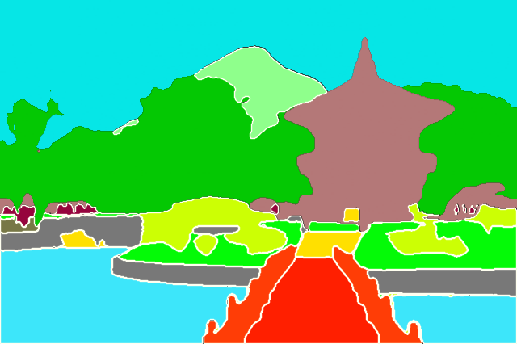

  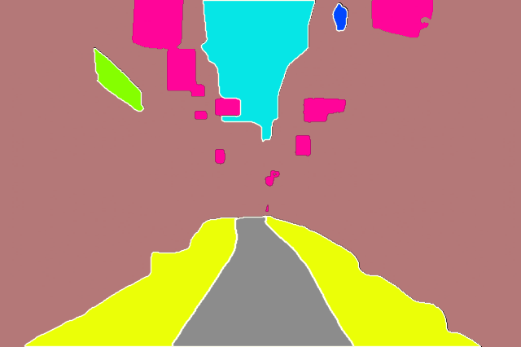

- 맵 이미지 (캐릭터 포함)

  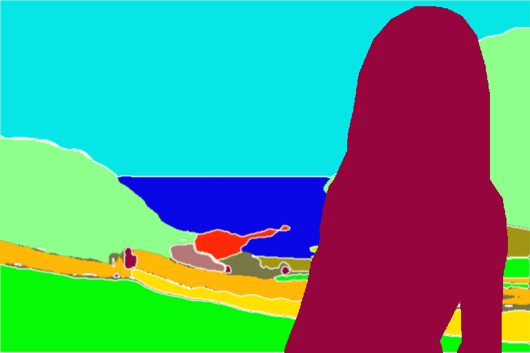

  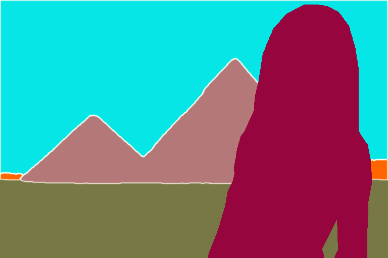

  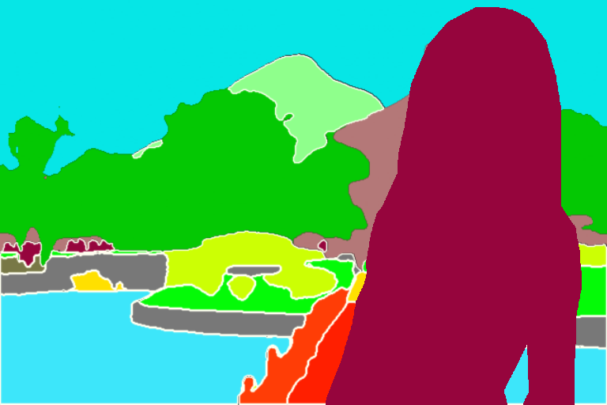

  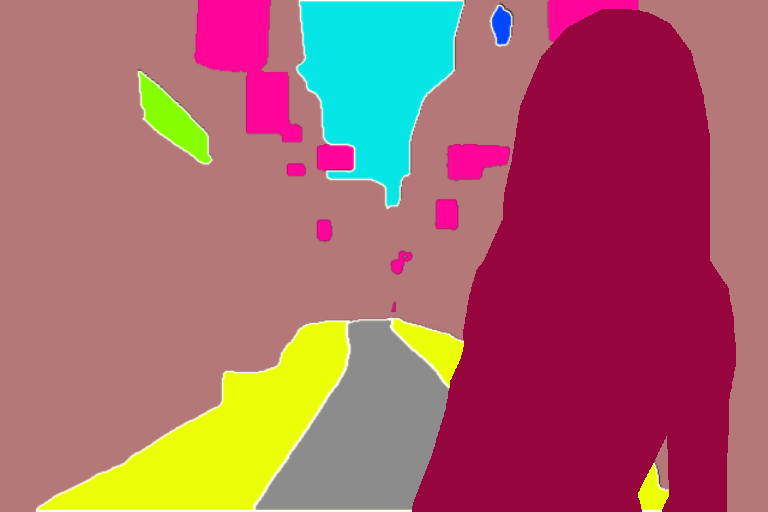

- 샘플 캐릭터 필터

  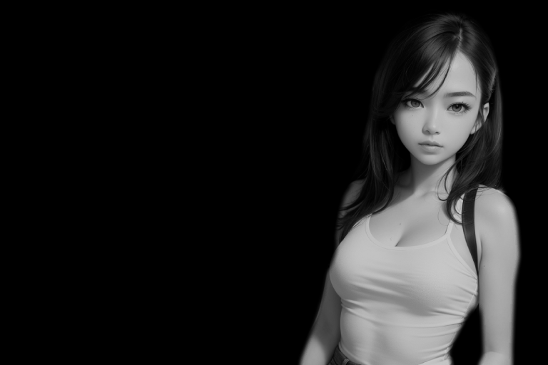

  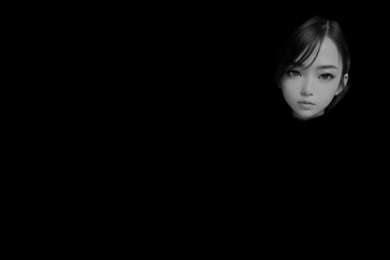
